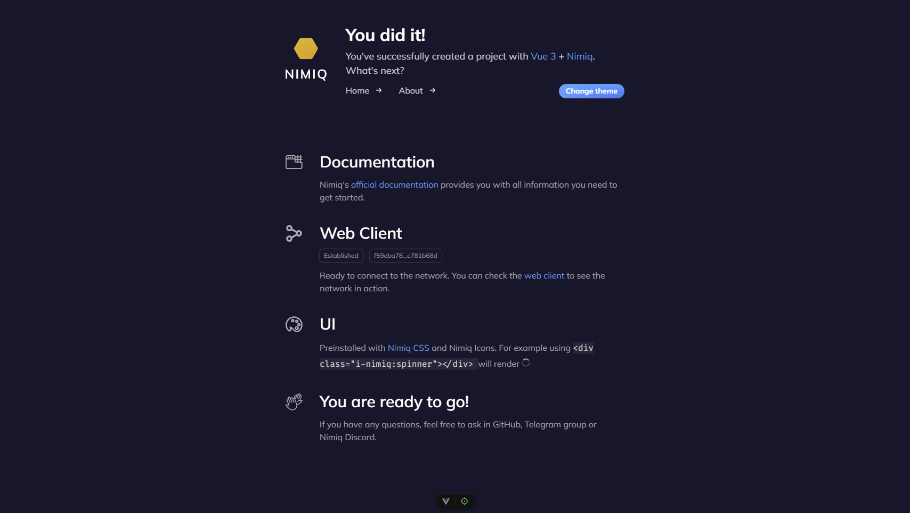

<h1 align="center">Nimiq Vue Template</h1>

<p align="center">
  <a href="https://github.com/onmax/nimiq-vue-template">
    
  </a>

<p align="center">
This template should help you get started developing with Nimiq in Vue 3. Highly opinionated!
<p>

<p align="center">
  <a href="https://codesandbox.io/p/github/onmax/nimiq-vue-template/main?import=true&layout=%257B%2522sidebarPanel%2522%253A%2522GIT%2522%252C%2522rootPanelGroup%2522%253A%257B%2522direction%2522%253A%2522horizontal%2522%252C%2522contentType%2522%253A%2522UNKNOWN%2522%252C%2522type%2522%253A%2522PANEL_GROUP%2522%252C%2522id%2522%253A%2522ROOT_LAYOUT%2522%252C%2522panels%2522%253A%255B%257B%2522type%2522%253A%2522PANEL_GROUP%2522%252C%2522contentType%2522%253A%2522UNKNOWN%2522%252C%2522direction%2522%253A%2522vertical%2522%252C%2522id%2522%253A%2522clulnm8fp0006356gxslexhfi%2522%252C%2522sizes%2522%253A%255B100%252C0%255D%252C%2522panels%2522%253A%255B%257B%2522type%2522%253A%2522PANEL_GROUP%2522%252C%2522contentType%2522%253A%2522EDITOR%2522%252C%2522direction%2522%253A%2522horizontal%2522%252C%2522id%2522%253A%2522EDITOR%2522%252C%2522panels%2522%253A%255B%257B%2522type%2522%253A%2522PANEL%2522%252C%2522contentType%2522%253A%2522EDITOR%2522%252C%2522id%2522%253A%2522clulnm8fp0002356gcn2x5ofe%2522%257D%255D%257D%252C%257B%2522type%2522%253A%2522PANEL_GROUP%2522%252C%2522contentType%2522%253A%2522SHELLS%2522%252C%2522direction%2522%253A%2522horizontal%2522%252C%2522id%2522%253A%2522SHELLS%2522%252C%2522panels%2522%253A%255B%257B%2522type%2522%253A%2522PANEL%2522%252C%2522contentType%2522%253A%2522SHELLS%2522%252C%2522id%2522%253A%2522clulnm8fp0004356geryynd9c%2522%257D%255D%252C%2522sizes%2522%253A%255B100%255D%257D%255D%257D%252C%257B%2522type%2522%253A%2522PANEL_GROUP%2522%252C%2522contentType%2522%253A%2522DEVTOOLS%2522%252C%2522direction%2522%253A%2522vertical%2522%252C%2522id%2522%253A%2522DEVTOOLS%2522%252C%2522panels%2522%253A%255B%257B%2522type%2522%253A%2522PANEL%2522%252C%2522contentType%2522%253A%2522DEVTOOLS%2522%252C%2522id%2522%253A%2522clulnm8fp0005356ge16lgdas%2522%257D%255D%252C%2522sizes%2522%253A%255B100%255D%257D%255D%252C%2522sizes%2522%253A%255B100%252C0%255D%257D%252C%2522tabbedPanels%2522%253A%257B%2522clulnm8fp0002356gcn2x5ofe%2522%253A%257B%2522tabs%2522%253A%255B%257B%2522id%2522%253A%2522clulnm8fp0001356gweihipgr%2522%252C%2522mode%2522%253A%2522permanent%2522%252C%2522type%2522%253A%2522FILE%2522%252C%2522filepath%2522%253A%2522%252FREADME.md%2522%257D%255D%252C%2522id%2522%253A%2522clulnm8fp0002356gcn2x5ofe%2522%252C%2522activeTabId%2522%253A%2522clulnm8fp0001356gweihipgr%2522%257D%252C%2522clulnm8fp0005356ge16lgdas%2522%253A%257B%2522id%2522%253A%2522clulnm8fp0005356ge16lgdas%2522%252C%2522tabs%2522%253A%255B%255D%257D%252C%2522clulnm8fp0004356geryynd9c%2522%253A%257B%2522id%2522%253A%2522clulnm8fp0004356geryynd9c%2522%252C%2522activeTabId%2522%253A%2522clulnmy9o00ai356g6226i4gx%2522%252C%2522tabs%2522%253A%255B%257B%2522id%2522%253A%2522clulnm8fp0003356g6uqy7ae5%2522%252C%2522mode%2522%253A%2522permanent%2522%252C%2522type%2522%253A%2522TERMINAL%2522%252C%2522shellId%2522%253A%2522clulnma2f0012def69szq4ong%2522%257D%252C%257B%2522type%2522%253A%2522TASK_LOG%2522%252C%2522taskId%2522%253A%2522CSB_RUN_OUTSIDE_CONTAINER%253D1%2520devcontainer%2520templates%2520apply%2520--template-id%2520%255C%2522ghcr.io%252Fdevcontainers%252Ftemplates%252Ftypescript-node%255C%2522%2520--template-args%2520%27%257B%257D%27%2520--features%2520%27%255B%255D%27%2522%252C%2522id%2522%253A%2522clulnmx0w004y356g3iz9t0o4%2522%252C%2522mode%2522%253A%2522permanent%2522%257D%252C%257B%2522type%2522%253A%2522TASK_LOG%2522%252C%2522taskId%2522%253A%2522dev%2522%252C%2522id%2522%253A%2522clulnmy9o00ai356g6226i4gx%2522%252C%2522mode%2522%253A%2522permanent%2522%257D%255D%257D%257D%252C%2522showDevtools%2522%253Afalse%252C%2522showShells%2522%253Afalse%252C%2522showSidebar%2522%253Atrue%252C%2522sidebarPanelSize%2522%253A15%257D"></a>
</p>

## Try it now!

This template requires Node >=18

### GitHub Template

Create a repo from this template on GitHub. You can use the button "Use this template" in the top right.

### Clone to local

If you prefer to do it manually with the cleaner git history

```bash
npx degit onmax/nimiq-vue-template my-awesome-nimiq-app 
cd my-awesome-nimiq-app
pnpm i
```

> [!NOTE]  
> If you don't have pnpm installed, run: `npm install -g pnpm`.
> Alternatively, you can delete `pnpm-lock.yaml` and use npm or yarn

## Features

- Includes `@nimiq/core@next` and connects to the Nimiq Albatross Testnet.
- Uses `nimiq-css` and `Nimiq Icons` for the UI. Supports dark mode!
- Uses `vue-router`, `vueuse` and `pinia`
- Added `unocss` with `attributify` mode.

## Recommended IDE Setup

[VSCode](https://code.visualstudio.com/) + [Volar](https://marketplace.visualstudio.com/items?itemName=Vue.volar).

## Project Setup

```sh
pnpm install
```

### Compile and Hot-Reload for Development

```sh
pnpm dev
```

### Type-Check, Compile and Minify for Production

```sh
pnpm build
```
